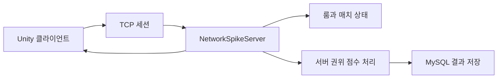

# Battery Rush Arena

외부 C# 서버와 MySQL 저장소를 붙인 Unity 멀티플레이어 수업 프로젝트입니다.

<p>
  
  
  
  
</p>

## 개요

Battery Rush Arena는 게임 네트워킹 수업을 위해 만든 작은 멀티플레이 게임 프로토타입입니다. Unity 클라이언트는 외부 authoritative C# 서버에 연결하고, MySQL은 매치와 점수 데이터를 저장합니다.

Windows 발표와 후속 개발을 고려해 저장소를 다음처럼 나눴습니다.

- Unity 프로젝트: `unity_midterm/`
- 서버: `src/NetworkSpikeServer/`
- DB 초기화: `docker/mysql/init/`
- 배포와 구조 문서: `docs/`

## 실행 구조



## 빠른 시작

필수 환경:

- Windows 10 또는 11
- Unity Hub와 Unity `6000.3.10f1`
- Unity Windows Build Support
- .NET 10 SDK
- MySQL 8 또는 Docker Desktop

실행 순서:

1. MySQL을 실행합니다.
2. C# 서버를 실행합니다.
3. Unity Hub에서 `unity_midterm/`을 엽니다.
4. `Assets/Scenes/SampleScene.unity`를 엽니다.
5. Play를 누르거나 Windows 클라이언트로 빌드합니다.

## Docker로 MySQL 실행

```bash
docker compose -f docker-compose.mysql.yml up -d
```

초기 스키마는 `docker/mysql/init/001-ckgame.sql`에 있습니다.

## 레포 구조

```text
.
├── unity_midterm/                  # Unity 클라이언트 프로젝트
├── src/NetworkSpikeServer/         # 외부 C# 서버
├── docker/mysql/init/              # DB 스키마
├── docs/                           # 구조와 Windows 데모 문서
├── design/                         # 게임 기획 문서
├── production/                     # 구현 진행 문서
└── prototypes/                     # 초기 네트워크 실험
```

## 문서

- `docs/repository-layout.md`
- `docs/windows-demo-deployment.md`
- `prototypes/network-session-spike.md`

## 개발 메모

- Unity Hub에서는 저장소 루트가 아니라 `unity_midterm/`을 엽니다.
- Windows에서는 `C:\dev\battery-rush-arena`처럼 짧은 ASCII 경로를 권장합니다.
- Unity 캐시 폴더와 생성된 발표 산출물은 Git에 넣지 않습니다.
- Codex 템플릿 자산은 별도 저장소 `Codex-Game-Studios`로 분리했습니다.
