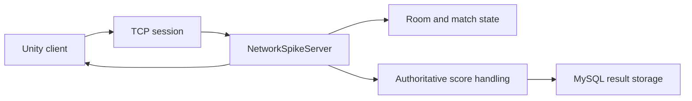

# Battery Rush Arena

Unity multiplayer course project with an external C# server and MySQL-backed match persistence.

<p>
  
  
  
  
</p>

## Overview

Battery Rush Arena is a small multiplayer game prototype built for a game networking course. The Unity client connects to an external authoritative C# server, while MySQL stores match and score data for demo review.

The repository is organized for Windows-based presentation and follow-up development:

- Unity project: `unity_midterm/`
- server: `src/NetworkSpikeServer/`
- database bootstrap: `docker/mysql/init/`
- deployment and layout notes: `docs/`

## Runtime Flow



## Quick Start

Requirements:

- Windows 10 or 11
- Unity Hub with Unity `6000.3.10f1`
- Unity Windows Build Support
- .NET 10 SDK
- MySQL 8 or Docker Desktop

Run order:

1. Start MySQL.
2. Start the C# server.
3. Open `unity_midterm/` in Unity Hub.
4. Open `Assets/Scenes/SampleScene.unity`.
5. Press Play or build a Windows client.

## MySQL With Docker

```bash
docker compose -f docker-compose.mysql.yml up -d
```

The initial schema lives in `docker/mysql/init/001-ckgame.sql`.

## Project Layout

```text
.
├── unity_midterm/                  # Unity client project
├── src/NetworkSpikeServer/         # External C# server
├── docker/mysql/init/              # Database schema
├── docs/                           # Layout and Windows demo notes
├── design/                         # Game-design notes
├── production/                     # Implementation progress notes
└── prototypes/                     # Early networking experiments
```

## Documentation

- `docs/repository-layout.md`
- `docs/windows-demo-deployment.md`
- `prototypes/network-session-spike.md`

## Development Notes

- Open `unity_midterm/`, not the repository root, in Unity Hub.
- Use a short ASCII Windows path such as `C:\dev\battery-rush-arena`.
- Keep Unity cache folders and generated presentation output out of Git.
- The Codex template assets were split into a separate repository: `Codex-Game-Studios`.
